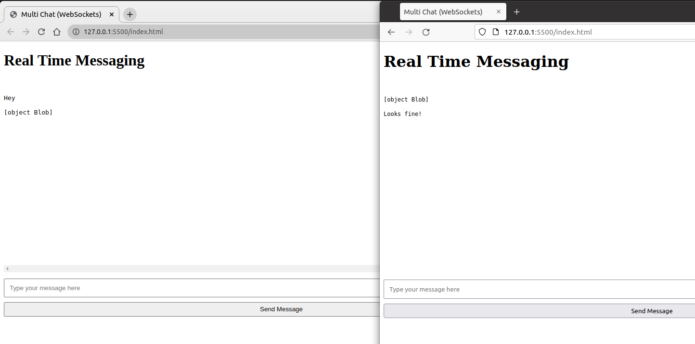

# Multi Chat

## Technologies

- WebSockets
- Node.js
- ExpressJS
- HTML
- JavaScript

## Setup

```code
# Clone this repo
git clone https://github.com/hesbon-osoro/websocket-chat.git

# go to the directory
cd websocket-chat && yarn

# Start the server
yarn start

# Go to the index.html then open it by the Live Server
# Copy the url to other browser's tab and experience the realtime chat capabilities
```


